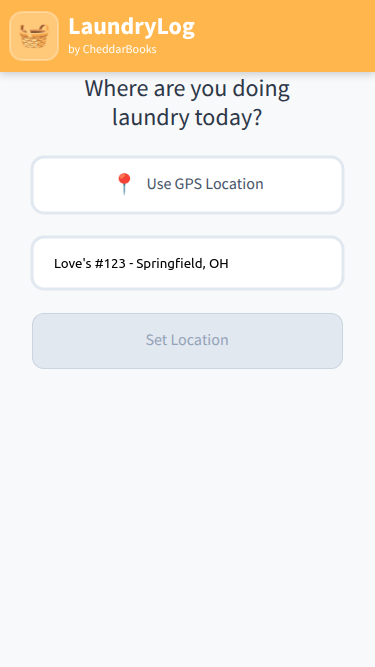
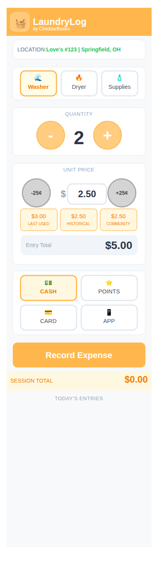

# LaundryLog Candidate Commands And CommandSlices

This note captures the current first-pass candidate commands for LaundryLog.

These commands are still early, but they give us the intent-side shape that should lead to the first durable events.

In the preferred Event Modeling language here, this is the `CommandSlice` side.

## First-Pass Commands

### 1. `CaptureLaundryLocation`

Meaning:

- the user wants the app to treat a specific location as the active laundry location

Why it likely matters:

- it is the business-side intent that leads to `LaundryLocationCaptured`
- it works for the manual typed path we are modeling now
- it can later also cover GPS-assisted or matched-location flows once those variants exist

Current actor screen for this command slice:

- `Screen.NewSession`



What this actor screen shows:

- the location-first prompt
- an optional GPS path that does not block the manual path
- the manually typed location example: `Love's #123 - Springfield, OH`
- the `Set Location` action that expresses the `CaptureLaundryLocation` intent

Current first-pass properties:

- `location_name`
  the user-facing location text the user is confirming
- `capture_method`
  how the location is being captured in this path

Current optional properties:

- `coordinates`
  only when GPS or map-assisted capture is actually involved
- `matched_location_id`
  only when an existing reusable location has already been matched
- `notes`
  only if we later decide location notes belong at command time

First concrete example: manual typed location

```toml
command_name = "CaptureLaundryLocation"
location_name = "Love's #123 - Springfield, OH"
capture_method = "manual-text"
```

Expected resulting event:

```toml
event_name = "LaundryLocationCaptured"
location_name = "Love's #123 - Springfield, OH"
capture_method = "manual-text"
recorded_at_utc = "2026-03-27T13:42:00Z"
```

What this command example pressures:

- the first command can stay simple for the manual path
- command fields do not need to carry every future GPS/matching detail yet
- durable event time can be added at event-recording time instead of being forced into the command
- the same command may still be broad enough for later acquisition variants

### 2. `LogLaundryExpense`

Meaning:

- the user wants to record one laundry expense under the active location context

Why it likely matters:

- it is the business-side intent that leads to `LaundryExpenseLogged`
- it stays aligned with the app name and the journaling idea
- repeated washer and dryer entries can use the same command shape

Current actor screen for the first washer expense command slice:

- `Screen.EntryForm`



What this actor screen shows:

- the active location context carried forward from the prior location capture
- washer as the first machine/expense choice being logged
- quantity and amount controls for one laundry expense
- the action surface that expresses the `LogLaundryExpense` intent

Current first-pass properties:

- `expense_kind`
  the kind of laundry expense being logged
- `quantity`
  how many machine runs or supply units are being logged
- `unit_price`
  the user-entered price per unit
- `payment_method`
  how this expense was paid

Current optional properties:

- `notes`
  only if we later decide freeform notes belong on the expense command
- `device_observed_at_local`
  only if we later want to carry a local-device observation hint before durable UTC event time is assigned

First concrete example: washer expense

```toml
command_name = "LogLaundryExpense"
expense_kind = "washer"
quantity = 1
unit_price = "3.00"
payment_method = "card"
```

Expected resulting event:

```toml
event_name = "LaundryExpenseLogged"
location_name = "Love's #123 - Springfield, OH"
expense_kind = "washer"
quantity = 1
unit_price = "3.00"
line_total = "3.00"
payment_method = "card"
occurred_at_utc = "2026-03-27T13:47:00Z"
recorded_at_utc = "2026-03-27T13:47:10Z"
```

Second concrete example: dryer expense

```toml
command_name = "LogLaundryExpense"
expense_kind = "dryer"
quantity = 1
unit_price = "2.50"
payment_method = "cash"
```

Expected resulting event:

```toml
event_name = "LaundryExpenseLogged"
location_name = "Love's #123 - Springfield, OH"
expense_kind = "dryer"
quantity = 1
unit_price = "2.50"
line_total = "2.50"
payment_method = "cash"
occurred_at_utc = "2026-03-27T13:58:00Z"
recorded_at_utc = "2026-03-27T13:58:08Z"
```

What these command examples pressure:

- washer and dryer can share one command shape
- the user-facing path should not need different commands for washer versus dryer
- line total can still be a durable event fact even if the command only carries quantity and unit price
- payment method belongs in the first path because it is part of the audit-defense journal value

Current next step:

- compare these examples directly against the visible-entry View examples
